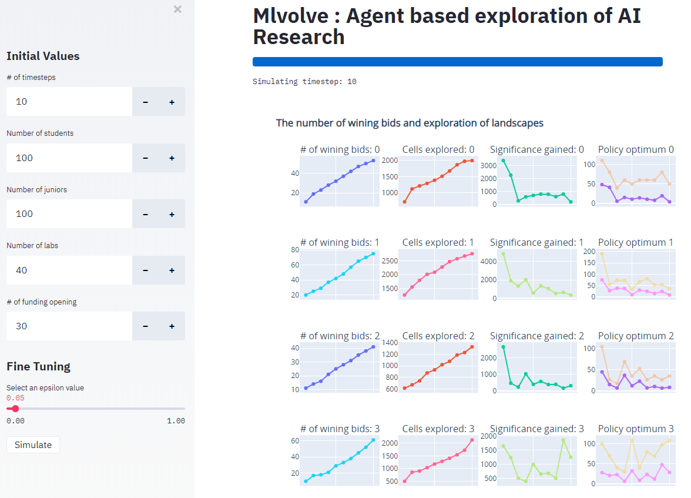

# MLvolve  

MLvolve is a agent based simulation of AI Research. The goal of the project is to understand how AI research evolves at multiple levels with multiple agents each with a unique set of incentives.The project is built in MESA and Pyro with a Pytorch Backend with visulisations powered by Plotly and GUI with Streamlit.  

To get started you need Python 3.6 or above then simply:
```
git clone https://github.com/Shivamshaiv/MLvolve
pip install -r requirements.txt
python model.py
```
To get started with the GUI, you need <a href = "https://www.streamlit.io/"> Streamlit  </a>:
```
git clone https://github.com/Shivamshaiv/MLvolve
pip install -r requirements.txt
streamlit run app_model.py
```
The GUI Webapp looks as under, however it is under development and could have bugs.


---

This project is build by [Shivam Patel](https://www.cser.ac.uk/team/shivam-patel/) as a part of his bachelors thesis at [The Center for the Study of Existential Risk, University of Cambridge](https://www.cser.ac.uk/) under the guidance of [Dr Shahar Avin](https://www.cser.ac.uk/team/shivam-patel/) and [Dr Jess Whittlestone](http://lcfi.ac.uk/team/jess-whittlestone/)


<p float="left">
  
  
   
</p>

